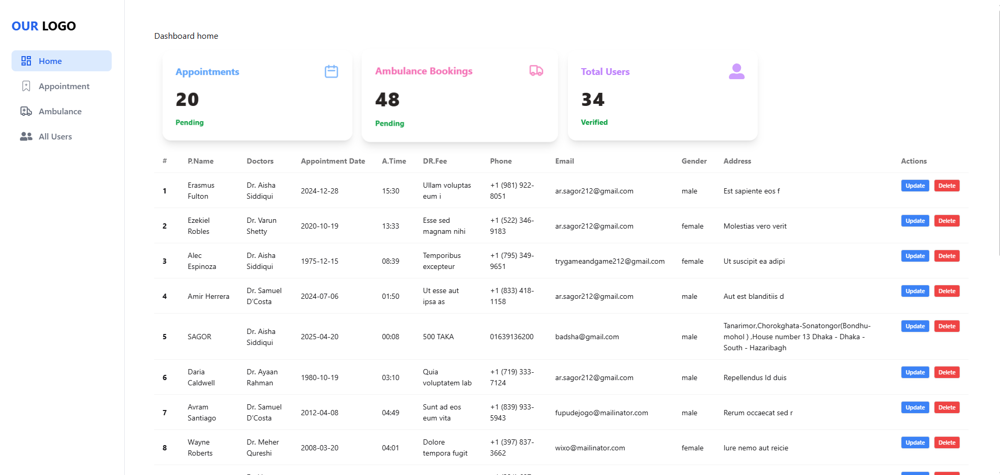
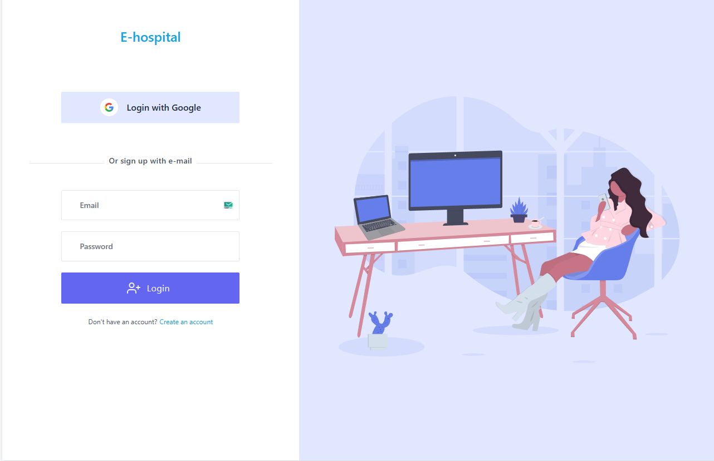
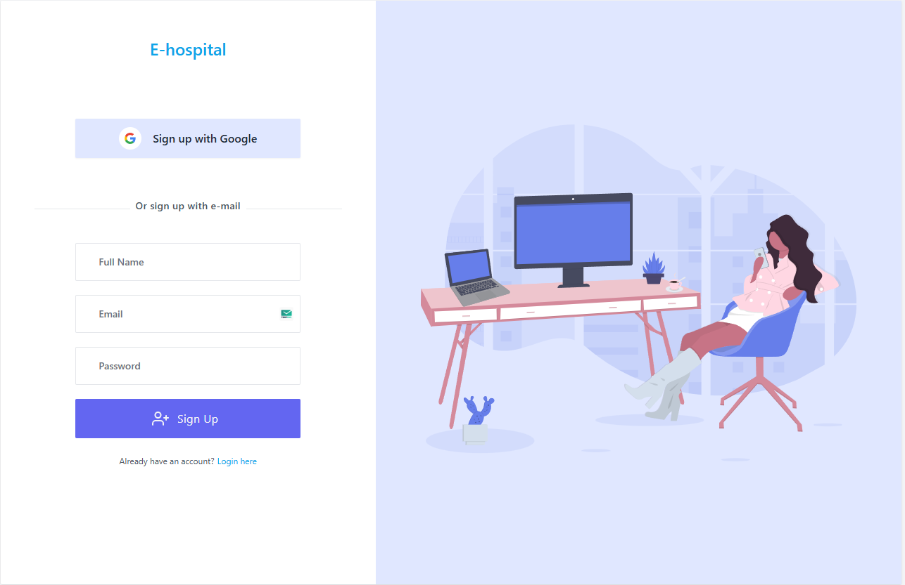

# Hospital Management System

# Responsive page

# Admin Dashboard

# Booing Doctor Appointment

# User Booking Cart

# Login/Sign Up

  
  

1 Install React icon for using icon
2 Install React helmet for sowing page title
3 Install React router for routing
4 Install React hook form for form validation
5 Install React Date picker for date picker
6 Install React hot toast for popup massage
7 Install React-Toastify for popup toast massage
8 Install AOS for using animation on scroll
